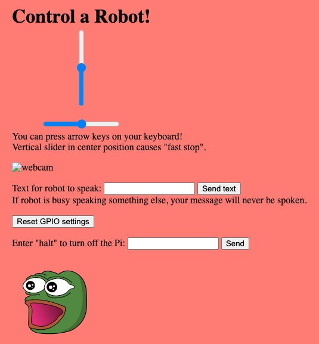
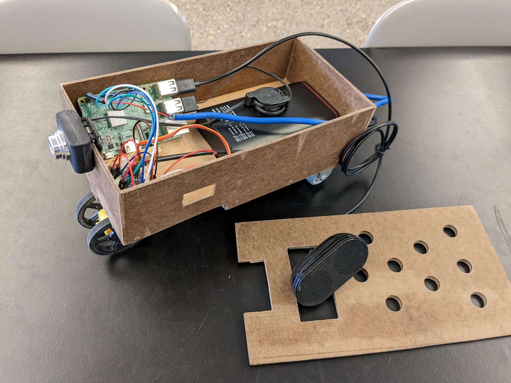
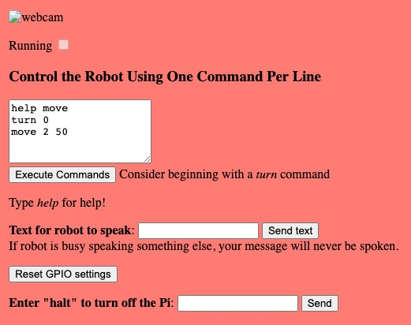

# WebSocket Raspberry-Pi Robot
A headless Raspberry Pi creates a web server that allows multiple users to control a robot. Control motors, speak using a speaker, and view a webcam.

Control a Raspberry-Pi-powered robot over the Internet or over any network via a WebSocket. See *webserver* folder. I use *pigpio* to control a servo motor and motor driver via Raspberry Pi's pins, including hardware PWM on GPIO12 and GPIO13. I use *child_process* to speak via *espeak* and USB speakers. Install *espeak* via: *sudo apt install espeak* . I also can display video from a webcam. The first step to setting up a webcam server is installing *motion* via: *sudo apt install motion* .

The Raspberry Pi will run Node.js code. Install Node.js and required modules via...
```
sudo apt install nodejs npm
npm install socket.io
npm install pigpio
```

Run it via: *sudo node webserver.js* . Both *pigpio* and *halt* require sudo. I recommend using *systemctl* to start the code at startup (*sudo* then not needed since *systemctl* is run as root). You can also automatically start the *motion* server via *systemctl*.

Once the code is running, just type the Pi's IP address into the web browser of any device that has access to that IP address! The following should appear...



Nice features...
- When one user moves a slider, the slider moves for all users.
- The vertical slider automatically goes back to the middle when you are no longer holding it.

Fixing various connection issues...
- If you don't have access to the router, things might still work on a local network. On Google Chrome, if [http://raspberrypi.local](http://raspberrypi.local) works on at least one device, you can find the Pi's IP address by going to chrome://net-internals/#dns
- If the webcam doesn't work on Chrome when using raspberrypi.local and the webcam never works when using the IPv6 address, find the line *ipv6_enabled off* in /etc/motion/motion.conf, change *off* to *on*, then restart *motion*.
- If you are connecting a computer to the Pi via a phone's hotspot and the connection is finicky, try unplugging the computer's Ethernet cable!

The code runs a servo motor that connects to a geared DC motor to control the front wheels. As long as you only are controlling a single servo motor and a single DC motor, I expect the code to work just fine, though different DC motor drivers will likely require modifications to the code. The hardware we used...
- Raspberry Pi 3B, which has two hardware-PWM channels and WiFi
- access to the router to (1) give the Pi a static IP address and possibly to also, if you are wanting to allow control from the Internet, (2) direct inbound traffic to the Pi. If you only want to control it via a local network and want the freedom to move to various locations, you can use a smartphone's hotspot as the router then use the phone to find the Pi's IP address. I don't think it works on all devices or perhaps even all routers, but I can sometimes connect to the Pi without needing a static (knowable) IP address by using raspberrypi.local as the location.
- S05NF STD servo motor. We created a small circuit to change the 3.3V PWM to 5V: [https://electronics.stackexchange.com/questions/359994/amplify-pwm-signal-from-exactly-0-3-3v-to-0-5v/360046#360046](https://electronics.stackexchange.com/questions/359994/amplify-pwm-signal-from-exactly-0-3-3v-to-0-5v/360046#360046). We played around with resistances to get the correct low and high voltages. The servo was finicky and would sometimes, especially for certain power supplies, start spinning in random directions or keeping spinning as if I was giving it a longer than 2 ms *on* signal for PWM. Using a cheap level shifter (such as an SN74AHCT125N, which is [well documented by Adafruit](https://www.adafruit.com/product/1787)) instead of the small circuit fixed it! You cannot just use *any* level shifter because the PWM wire of the servo motor draws some current.
- DRV8833 motor driver. Adafruit sells one in a nice breakout board. This one has MOSFETs as its transistors, so it works well with our 5V motors.
- dual-shaft geared DC motor with a wheel attached on each side. An L bracket (from Adafruit) was used to connect it to the servo motor.
- $13 USB speakers from Amazon. Code can easily be changed to use non-USB speakers, but USB speakers are great because they are powered through the USB!
- $5 USB webcam from Amazon
- Ayeway PD-2620W battery pack. The 26,800 mAh is way more than we need, and we only used the 5 volts from any of the 3 blue USB ports, which has a 3 amp maximum. USB cables were used to power things. The cables can be spliced to more convenient wires that are thick and short enough to carry requires current. Grounds between USB cables were connected on a mini breadboard (the same one that had the DRV8833) to create a common ground. The Raspberry Pi got a dedicated USB cable to power it (motors were powered from another cable). Even so, when the DC motor was stalled or was not allowed to spin freely, the battery was likely delivering approximately its 3-amp limit, and the Raspberry Pi would not get enough voltage causing the webcam to not function well (though I partly blame the very cheap webcam). We fixed this by using a dedicated 2-amp battery for the Raspberry Pi.
- 2 rigid (non-swivel) casters with a wheel diameter of 32 mm




## Scripting language to control the robot!

CodingKraken, [https://github.com/CodingKraken](https://github.com/CodingKraken), wrote an impressive modular scripting language for controlling a robot (unpublished), which I used to make the *webserverScript* folder! This simple currently-3-command language can be useful if the webcam has a huge delay or if you want to have fun trying to program obstacle courses! The scripting language is simple and its documentation can be interactively used by typing the *help* command. Improper syntax is found before the starting to run the first line of your script. If your or another user's script is running, the *Running* box will be checked preventing new scripts from being run and preventing the "Reset GPIO settings" button from working.

If you want to control a different servo motor (or control the one I used differently), search for all instances of *pinServo* in all of the JavaScript files. If you want to control a different DC motor (or control the one I used differently), search for all instances of *pinMotor* in all of the JavaScript files.

If you want to create a new command (such as *pause*), add its file in the *commands* folder. In the file, export the *errorCheck*, *run*, and *config* methods. See existing command files for guidance.


